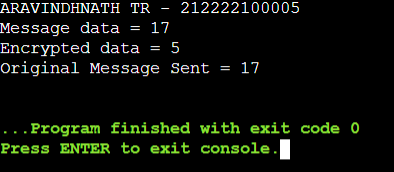

# EX-9 : IMPLEMENTATION-OF-RSA(Rivest, Shamir, Adleman)

## AIM:
  To write a C program to implement the RSA encryption algorithm.
  
## ALGORITHM:

  STEP-1: Select two co-prime numbers as p and q.
  
  STEP-2: Compute n as the product of p and q. 
  
  STEP-3: Compute (p-1)*(q-1) and store it in z.
  
  STEP-4: Select a random prime number e that is less than that of z.
  
  STEP-5: Compute the private key, d as e * mod-1(z).
  
  STEP-6: The cipher text is computed as messagee *
  
  STEP-7: Decryption is done as cipherdmod n.
  
## PROGRAM: 
```C
#include <stdio.h>
#include <math.h>

// Function to compute GCD
int gcd(int a, int h) {
    int temp;
    while(1) {
        temp = a % h;
        if (temp == 0)
            return h;
        a = h;
        h = temp;
    }
}

int main() {
    printf("ARAVINDHNATH TR - 212222100005\n");
    // Two prime numbers
    int p = 3;
    int q = 7;
    
    // Public and private keys
    int n = p * q;
    int phi = (p - 1) * (q - 1);
    int e = 2;

    // Find e such that gcd(e, phi) = 1
    while (e < phi) {
        if (gcd(e, phi) == 1)
            break;
        else
            e++;
    }

    // Choose k (integer multiplier)
    int k = 2;
    
    // Calculate d (Private key)
    int d = (1 + (k * phi)) / e;

    // Message to be encrypted
    int msg = 12;
    
    printf("Message data = %d\n", msg);

    // Encryption: c = (msg ^ e) % n
    long long c = (long long)pow(msg, e) % n;
    printf("Encrypted data = %lld\n", c);

    // Decryption: m = (c ^ d) % n
    long long m = (long long)pow(c, d) % n;
    printf("Original Message Sent = %lld\n", m);
 
    return 0;
}
```

## OUTPUT:


## RESULT:
  Thus the C program to implement RSA encryption technique had been implemented successfully
